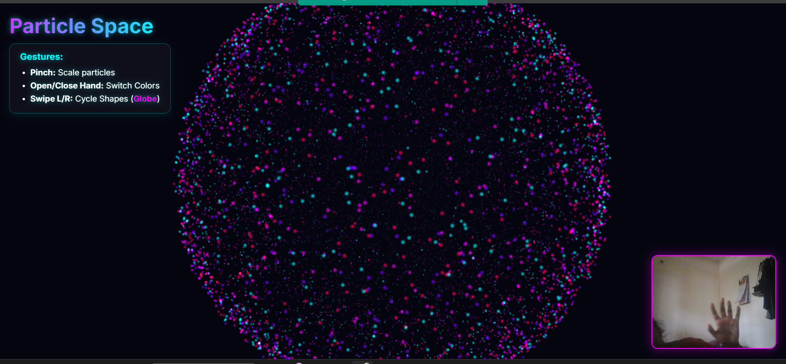

# ✨ Particle Space — Gesture-Controlled 3D Particle Art

An interactive 3D particle system that morphs **10,000 particles** into stunning shapes — all controlled in real-time using **hand gestures** via your webcam.

Built with **Three.js** for GPU-accelerated rendering and **MediaPipe Hand Landmarker** for markerless hand tracking. Zero dependencies to install — runs entirely in the browser.



## 🎮 Gesture Controls

| Gesture | Action |
|---|---|
| ✌️ **Pinch** (thumb + index) | Scale particles up / down |
| 🖐️ **Open / Close hand** | Toggle color palette (Neon ↔ Synthwave) |
| 👉 **Swipe left / right** | Cycle through shapes |

## 🔮 Available Shapes

| | | |
|---|---|---|
| ❤️ Heart | 🌸 Flower | 🪐 Saturn |
| ⚡ Arc Reactor | 🌍 Globe | 🧬 DNA Helix |
| 📌 Needles | 🌾 Milkweed | 🍅 Tomato |

Each shape is **procedurally generated** using mathematical functions — from Taubin's Heart surface equation to parametric double-helix DNA strands.

## ⚡ Tech Stack

- **[Three.js](https://threejs.org/)** — WebGL-powered 3D particle rendering with additive blending & fog
- **[MediaPipe Tasks Vision](https://developers.google.com/mediapipe)** — Real-time hand landmark detection (21 keypoints) via webcam
- **Vanilla JS** — Pure ES modules with import maps, zero build tools

## 🚀 Quick Start

```bash
# Clone the repository
git clone https://github.com/AndarnaTairn/Particle_art.git
cd Particle_art

# Serve locally (any static server works)
npx serve .
```

Then open `http://localhost:3000`, allow webcam access, and start gesturing!

> ⚠️ **Requirements:** Webcam + modern browser with WebGL support (Chrome, Edge, or Firefox recommended).

## 📁 Project Structure

```
Particle_art/
├── index.html          # Entry point with import maps for Three.js & MediaPipe
├── main.js             # App initialization & animation loop
├── ParticleSystem.js   # 3D particle engine — shape generation, colors & rendering
├── HandTracker.js      # MediaPipe hand tracking — gesture detection & callbacks
└── style.css           # UI overlay styling
```

## 🤝 Contributing

Contributions are welcome! Feel free to open issues or submit PRs for:
- New particle shapes
- Additional color palettes
- Performance optimizations
- Multi-hand support

## 📄 License

MIT License — feel free to use, modify, and share.
